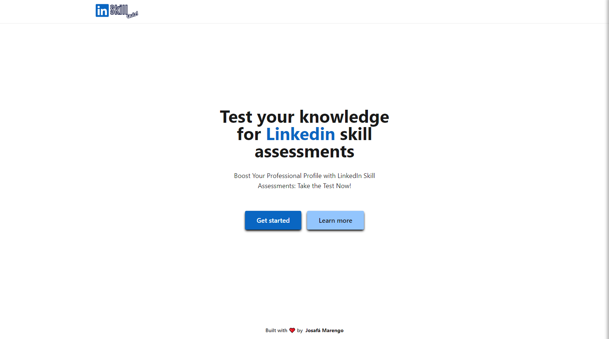
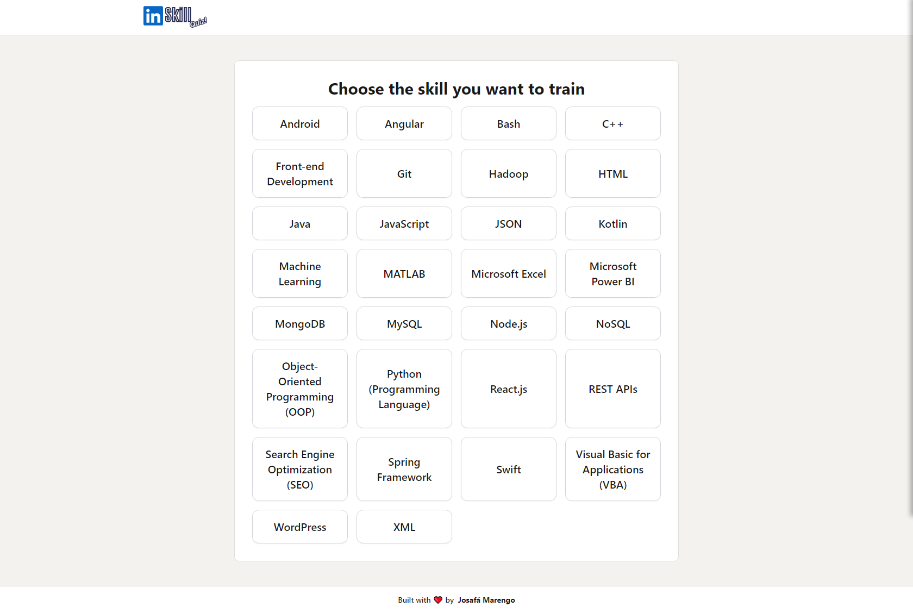
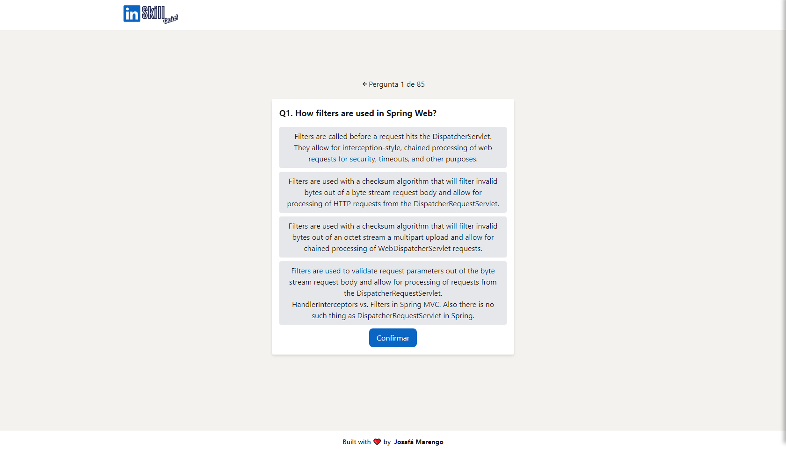

<a name="readme-top"></a>

[![LinkedIn][linkedin-shield]][linkedin-url]


[![Issues][issues-shield]][issues-url]
[![License][license-shield]][license-url]


  <br />
<div align="center">
  

  <h3 align="center">LinkedIn Skill Quiz</h3>

  <p align="center">
    Boost Your Professional Profile with LinkedIn Skill Assessments: Take the Test Now!
    <br />
    <br />
    <a href="https://linkedin-skill-assessments.netlify.app/">View Demo</a>
    ·
    <a href="https://github.com/josafamarengo/skill-assessments/issues">Report Bug</a>
    ·
    <a href="https://github.com/josafamarengo/skill-assessments/issues">Request Feature</a>
  </p>

</div>

## 🔍 Table of Contents
  <ol>
    <li>
      <a href="#about-the-project">About The Project</a>
      <ul>
        <li><a href="#built-with">Built With</a></li>
      </ul>
    </li>
    <li>
      <a href="#getting-started">Getting Started</a>
      <ul>
        <li><a href="#prerequisites">Prerequisites</a></li>
        <li><a href="#installation">Installation</a></li>
      </ul>
    </li>
    <li><a href="#roadmap">Roadmap</a></li>
    <li><a href="#contributing">Contributing</a></li>
    <li><a href="#license">License</a></li>
    <li><a href="#contact">Contact</a></li>
    <li><a href="#acknowledgments">Acknowledgments</a></li>
  </ol>

<a name="about-the-project"></a>
## ℹ️ About The Project




I had the idea to build this project because I was planning to do some Linkedin skills assessments, but I wanted to test my knowledge first.

I had already visited the [Ebazhanov's Github repository](https://github.com/Ebazhanov/linkedin-skill-assessments-quizzes) that collects questions that users have answered in their assessments.

And I saw an immersion of [Alura](https://www.alura.com.br/) with [Mario Souto](https://github.com/omariosouto) and [Juliana Amoasei](https://github.com/JulianaAmoasei) in early March 2023, where they developed a quiz.

When I was putting things together, I thought of using the questions available in this repository as a database for a competency quiz project.

To extract the questions from the Markdown file they were in and put them into a semi-structured file like JSON, I created the following script in Python:

```python	
import markdown
import json
import requests

# Defines the link to the Markdown file
url_arquivo = 'https://raw.githubusercontent.com/Ebazhanov/linkedin-skill-assessments-quizzes/main/html/html-quiz.md'

# Makes an HTTP request to get the contents of the file
conteudo_arquivo = requests.get(url_arquivo).text

# Converts the contents of the file from Markdown to HTML
conteudo_html = markdown.markdown(conteudo_arquivo)

# Selects only the content of the <h2> tag
titulo = conteudo_html.split('<h2>')[1].split('</h2>')[0]

# Selects only the content of the <h4> tag
questions = conteudo_html.split('<h4>')[1:]
questions = [q.replace('</h4>', '') for q in questions]

# Separate questions from alternatives by storing them in a dictionary
for i, q in enumerate(questions):
    question = q.split('<ul>')[0]
    alternatives = q.split('<li>')[1:]
    alternatives = [a.replace('</li>', '') for a in alternatives]
    is_correct = [True if '[x]' in a else False for a in alternatives]
    alternatives = [a.replace('[x]', '') for a in alternatives]
    alternatives = [a.replace('[ ]', '') for a in alternatives]
    alternatives = [{'alternative': a, 'is_correct': c} for a, c in zip(alternatives, is_correct)]
    questions[i] = {
        'question': question,
        'alternatives': alternatives
    }

# Create a dictionary to store questions
conteudo_json = {
    'title': titulo,
    'questions': questions
}

nome_arquivo = titulo + '.json'
with open(nome_arquivo, 'w') as f:
    json.dump(conteudo_json, f)
```

From there, I created the front end to use the constant data in the JSON files.

### Built With


<p align="right">(<a href="#readme-top">back to top</a>)</p>

<a name="getting-started"></a>
## 🚀 Getting Started

To get a local copy up and running follow these simple steps.

### Prerequisites

- [Node.js](https://nodejs.org/en/)
- [Git](https://git-scm.com/)


### Installation

1. Clone the repo

```bash

git clone https://github.com/josafamarengo/skill-assessments.git

```

2. Go to project folder

```bash

cd skill-assessments

```

3. Install packages

```bash

npm install

```

OR

```bash

yarn

```

<p align="right">(<a href="#readme-top">back to top</a>)</p>

<a name="roadmap"></a>
## 🗺️ Roadmap

See the [open issues](https://github.com/josafamarengo/skill-assessments/issues) for a list of proposed features (and known issues).

- [ ] Use Matter.js to create an animation 
- [ ] Add Authentication
- [ ] Add a profile page

<a name="contributing"></a>
## 👥 Contributing

Any contributions you make are **greatly appreciated**. Before you get started, please take a moment to review our Code of Conduct and Contributing Guidelines.

### How to Contribute

<ol>
  <li>Fork this repository to your own GitHub account.</li>
  <li>Follow the steps on <a href="#getting-started">Getting Started Section</a>.</li>
  <li>Create a new branch for your:</li>
    <ol>
      <li>Feature <code>git checkout -b feature/your-feature</code></li>
      <li>Bug fix <code>git checkout -b bugfix/bug</code></li>
      <li>Docs, improvments, refactoring, optmizing,... <code>git checkout -b requirement/your-requirement</code>.</li>
    </ol>
  <!-- <li>Make your changes and ensure they pass the tests by running <code>npm test</code> or <code>yarn test</code>.</li> -->
  <li>Commit your changes with clear and concise commit messages following the <a href="https://github.com/angular/angular.js/blob/master/DEVELOPERS.md#-git-commit-guidelines">Angular commit convention</a></li>
  <li>Push your changes to your forked repository.</li>
  <li>Submit a pull request to our repository with a description of your changes.</li>
</ol>

Please make sure to write clear commit messages and to follow our coding conventions. We appreciate your contributions and will review them as soon as possible!


### Issue Tracker

If you encounter any bugs or have feature requests, please open an issue on our [Issue Tracker][issues-url]. Be sure to include a clear and concise description of the issue, any steps needed to reproduce the problem, and any relevant code snippets.

### Code of Conduct

Please review our Code of Conduct before contributing. We expect all contributors to abide by the principles outlined in the document.

### Contributing Guidelines

Please review our Contributing Guidelines before contributing. These guidelines will provide details on how to contribute to the project, the coding standards we follow, and the development process we use.

### Attribution

This Contributing section is adapted from the Contributing Guidelines template created by PurpleBooth.


<p align="right">(<a href="#readme-top">back to top</a>)</p>

<a name="license"></a>
## 📜 License

Distributed under the GNU General Public License v3.0. See `LICENSE` for more information.

<a name="contact"></a>
## 📧 Contact

[![Linkedin][linkedin-shield]][linkedin-url]
[![Email][email-shield]][email-url]
[![Portfolio][site-shield]][site-url]

<a name="acknowledgments"></a>
## 🙏 Acknowledgments

- [Ebazhanov](https://github.com/Ebazhanov) - [linkedin-skill-assessments-quizzes](https://github.com/Ebazhanov/linkedin-skill-assessments-quizzes)
- [Alura](https://www.alura.com.br/) - AluraQuiz
- [Ícone do Quiz](https://icons8.com/icon/f3o1AGoVZ2Un/test-passed)

<p align="right">(<a href="#readme-top">back to top</a>)</p>

<div align="center">
  <sub>Built with ❤︎ by <a href="https://josafa.com.br">Josafá Marengo</a>
</div>

<!-- MARKDOWN LINKS & IMAGES -->
<!-- https://www.markdownguide.org/basic-syntax/#reference-style-links -->

<!-- REPO LINK -->
[repo-url]: https://github.com/josafamarengo/skill-assessments
[issues-url]: https://github.com/josafamarengo/skill-assessments/issues

[contributors-shield]: https://img.shields.io/github/contributors/josafamarengo/skill-assessments.svg?style=flat
[contributors-url]: https://github.com/josafamarengo/skill-assessments/graphs/contributors
[forks-shield]: https://img.shields.io/github/forks/josafamarengo/skill-assessments.svg?style=flat
[forks-url]: https://github.com/josafamarengo/skill-assessments/network/members
[stars-shield]: https://img.shields.io/github/stars/josafamarengo/skill-assessments.svg?style=flat
[stars-url]: https://github.com/josafamarengo/skill-assessments/stargazers
[issues-shield]: https://img.shields.io/github/issues/josafamarengo/skill-assessments.svg?style=flat
[issues-url]: https://github.com/josafamarengo/skill-assessments/issues
[license-shield]: https://img.shields.io/github/license/josafamarengo/skill-assessments.svg?style=flat
[license-url]: https://github.com/josafamarengo/skill-assessments/blob/main/LICENSE.md

<!-- SOCIAL LINKS -->
[linkedin-shield]: https://img.shields.io/badge/LinkedIn-0077B5?style=flat&logo=linkedin&logoColor=white
[linkedin-url]: https://linkedin.com/in/josafamarengo

[email-shield]: https://img.shields.io/badge/Gmail-D14836?style=flat&logo=gmail&logoColor=white
[email-url]: https://josafa.com.br/#contact

[site-shield]: https://img.shields.io/badge/website-000000?style=flat&logo=Google-chrome&logoColor=white
[site-url]: https://josafa.com.br


<!-- LANGUAGES -->
[AWS]: https://img.shields.io/badge/Amazon_AWS-FF9900?style=for-the-badge&logo=amazonaws&logoColor=white
[Actions]: https://img.shields.io/badge/GitHub_Actions-2088FF?style=for-the-badge&logo=github-actions&logoColor=white
[Next]: https://img.shields.io/badge/next.js-000000?style=for-the-badge&logo=nextdotjs&logoColor=white
[React]: https://img.shields.io/badge/React-20232A?style=for-the-badge&logo=react&logoColor=61DAFB
[Native]: https://img.shields.io/badge/React_Native-20232A?style=for-the-badge&logo=react&logoColor=61DAFB
[Kotlin]: https://img.shields.io/badge/Kotlin-0095D5?&style=for-the-badge&logo=kotlin&logoColor=white
[Swift]: https://img.shields.io/badge/Swift-FA7343?style=for-the-badge&logo=swift&logoColor=white
[Redux]: https://img.shields.io/badge/Redux-593D88?style=for-the-badge&logo=redux&logoColor=white
[Vue]: https://img.shields.io/badge/Vue.js-35495E?style=for-the-badge&logo=vuedotjs&logoColor=4FC08D
[Angular]: https://img.shields.io/badge/Angular-DD0031?style=for-the-badge&logo=angular&logoColor=white
[Styled]: https://img.shields.io/badge/styled--components-DB7093?style=for-the-badge&logo=styled-components&logoColor=white
[Tailwind]: https://img.shields.io/badge/Tailwind_CSS-38B2AC?style=for-the-badge&logo=tailwind-css&logoColor=white
[SaSS]: https://img.shields.io/badge/Sass-CC6699?style=for-the-badge&logo=sass&logoColor=white
[Rust]: https://img.shields.io/badge/Rust-000000?style=for-the-badge&logo=rust&logoColor=white
[Python]: https://img.shields.io/badge/Python-14354C?style=for-the-badge&logo=python&logoColor=white
[R]: https://img.shields.io/badge/R-276DC3?style=for-the-badge&logo=r&logoColor=white
[Oracle]: https://img.shields.io/badge/Oracle-F80000?style=for-the-badge&logo=Oracle&logoColor=white
[Elastic]: https://img.shields.io/badge/Elastic_Search-005571?style=for-the-badge&logo=elasticsearch&logoColor=white
[Mongo]: https://img.shields.io/badge/MongoDB-4EA94B?style=for-the-badge&logo=mongodb&logoColor=white
[MySQL]: https://img.shields.io/badge/MySQL-005C84?style=for-the-badge&logo=mysql&logoColor=white
[Neo4J]: https://img.shields.io/badge/Neo4j-018bff?style=for-the-badge&logo=neo4j&logoColor=white
[Redis]: https://img.shields.io/badge/redis-%23DD0031.svg?&style=for-the-badge&logo=redis&logoColor=white
[SQLite]: https://img.shields.io/badge/SQLite-07405E?style=for-the-badge&logo=sqlite&logoColor=white
[PostgreSQL]: https://img.shields.io/badge/PostgreSQL-316192?style=for-the-badge&logo=postgresql&logoColor=white


